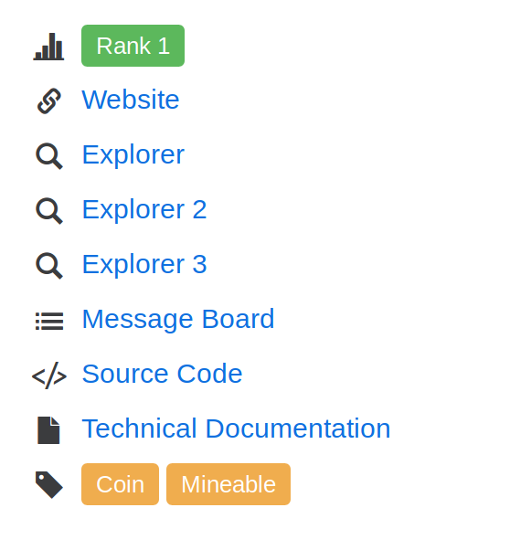
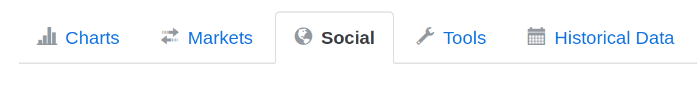

The is a webcrawling task where we want to create an index of links taken from
www.coinmarketcap.com.

Associated with each coin is
 1. An Official Website
 1. a reddit, a twitter or both
 1. A github repository
 1. maybe a block explorer
 1. other community addresses - could be a chat or a forum

Our goal is to create an index of all of these websites - so our output will a csv
file with each row representing one coin, and each column containing urls.

Why do this? Once we have an index of these sites we can crawl and scrape more data
from these various locations and do analysis.

The default setting will take the first page of <a href="http://www.coinmarketcap.com">coinmarketcap</a>
(top 100) and will give us all of the currency pages.

On each of the pages there is a box that looks like this  
</img>

From here we can get some links that relate to the coin, and there is a tab
at the bottom of the screen which looks like this
</img>

From here we can get links to a reddit pages and sometimes twitter - which
we can scrape and use for some kind of sentiment analysis.

All of the pages related to each of these coins can be tracked and used for
analysis.

If you are interested in tracking github statistics then please check
<a href = "https://github.com/EasyMode1991/github-summariser">this</a> out

If you want to do some sentiment analysis on their social feeds then please have
a look at <a href="www.google.com">this</a>
